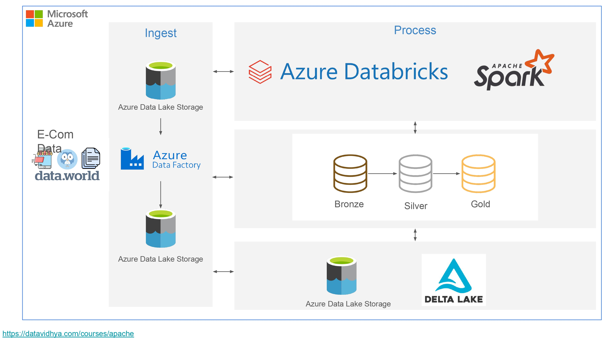

# End-to-End Implementation of E-commerce Project using Azure Data Engineering

## Introduction
This e-commerce project showcases an end-to-end data pipeline implementation using Azure technologies. The solution leverages Azure Data Lake Storage Gen2 for scalable and secure data storage, Azure Data Factory for orchestrating data movement and transformation, and Azure Databricks for advanced analytics and data processing.

## Architecture

## Technology Used
1. Programming Language - Pyspark
2. Scripting Language - SQL
3. Azure Cloud
   - Azure Databricks
   - Azure DataFactory
   - Azure DataLake Storage Gen2
  
## Dataset Used
This dataset aims to serve as a benchmark for an e-commerce fashion store. Using this dataset, you may want to try and understand what you can expect of your users and determine in advance how your grows may be.

Here is the link to the dataset : https://data.world/jfreex/e-commerce-users-of-a-french-c2c-fashion-store

## Pyspark Scripts for Medallion Architecture
https://github.com/Rajeshwar1399/E-commerce-Project-using-Azure-Cloud/tree/main/Databricks%20Notebooks

